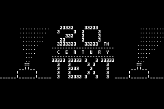
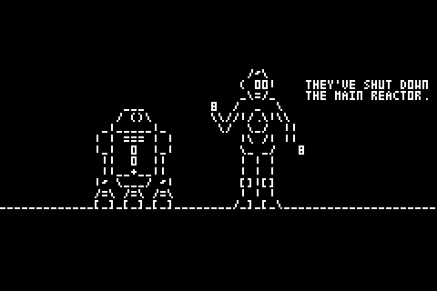

# towel.blinkinglights.gba
The venerable Starwars ascii telnet animation ported to gba

For a long time, you could stream a StarWars ascii animation in the command line with `telnet towel.blinkenlights.nl`. The server died a few years ago, but here's the original animation ported to Gameboy Advance.

</img>
</img>

## Compiling

Run build.sh to compile. The build script just appends starwars.txt to the compiled driver program in the ROM, so technically you could make your own animations.
